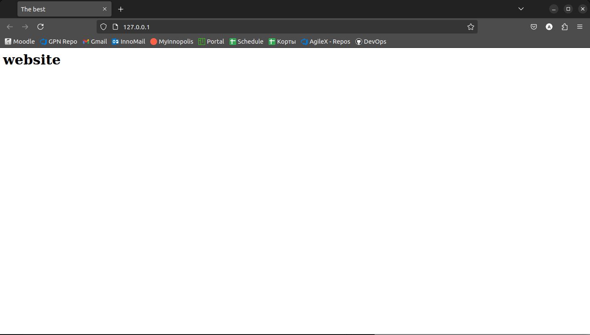

# Lab 7: Containers Lab - Docker
## Anton Buguev, a.buguev@innopolis.university, M23-RO-01

### Task 1. Container management.

1. List containers
```sh
$ docker ps -a

CONTAINER ID   IMAGE         COMMAND    CREATED         STATUS                     PORTS     NAMES
62e22b20bbb3   hello-world   "/hello"   24 minutes ago   Exited (0) 24 minutes ago             nifty_sanderson
```

2. Pull latest Ubuntu image
```sh
$ docker pull ubuntu:latest

latest: Pulling from library/ubuntu
9c704ecd0c69: Pull complete 
Digest: sha256:2e863c44b718727c860746568e1d54afd13b2fa71b160f5cd9058fc436217b30
Status: Downloaded newer image for ubuntu:latest
docker.io/library/ubuntu:latest
```

3. Run container
```sh
$ docker run -it --name ubuntu_container ubuntu:latest

root@38e1eb4b2803:/# 
```

Check running containers in different terminal:
```sh
$ docker ps -a

CONTAINER ID   IMAGE           COMMAND       CREATED         STATUS                     PORTS     NAMES
38e1eb4b2803   ubuntu:latest   "/bin/bash"   14 seconds ago   Up 13 seconds                         ubuntu_container
62e22b20bbb3   hello-world     "/hello"      25 minutes ago   Exited (0) 25 minutes ago             nifty_sanderson
```

4. Remove image
```sh
$ docker rmi ubuntu:latest

Error response from daemon: conflict: unable to remove repository reference "ubuntu:latest" (must force) - container 38e1eb4b2803 is using its referenced image 35a88802559d
```
Removing container failed.

### Task 2. Image and Container Operations.

1. Create image archive
```sh
$ docker save -o ubuntu_image.tar ubuntu:latest
```

2. Run Nginx
```sh
$ docker run -d -p 80:80 --name nginx_container nginx

Unable to find image 'nginx:latest' locally
latest: Pulling from library/nginx
f11c1adaa26e: Pull complete 
c6b156574604: Pull complete 
ea5d7144c337: Pull complete 
1bbcb9df2c93: Pull complete 
537a6cfe3404: Pull complete 
767bff2cc03e: Pull complete 
adc73cb74f25: Pull complete 
Digest: sha256:67682bda769fae1ccf5183192b8daf37b64cae99c6c3302650f6f8bf5f0f95df
Status: Downloaded newer image for nginx:latest
92fd07b484c5292bb015ae1fc796d9f2102a7786db26f4c8b09b65b9ff7f4f83
```


3. Copy HTML file `index.html` to the container:
```sh
$ docker cp index.html nginx_container:/usr/share/nginx/html/index.html

Successfully copied 2.05kB to nginx_container:/usr/share/nginx/html/index.html
```


4. Create custom image
```sh
$ docker commit nginx_container my_website:latest

sha256:42ae43e138a8a537ec4df5ef29c953181e81d9ee6baed50762d9751bbd0c3ecc
```

5. Remove original image
```sh
$ docker rm -f nginx_container

nginx_container
```

6. Create new container
```sh
$ docker run -d -p 80:80 --name my_website_container my_website:latest

2fc628d0e7df37ed8dde57d5f438a70dbb017f37e06dfbe7724f215dcee549eb
```

7. Access the server
```sh
$ curl http://127.0.0.1:80

<html>
<head>
<title>The best</title>
</head>
<body>
<h1>website</h1>
</body>
</html>
```


8. Check the difference
```sh
docker diff my_website_container
C /etc
C /etc/nginx
C /etc/nginx/conf.d
C /etc/nginx/conf.d/default.conf
C /run
C /run/nginx.pid
```
Here we can see the list of directories and files that were changed (they are marked with **C**) from the moment the container was created.