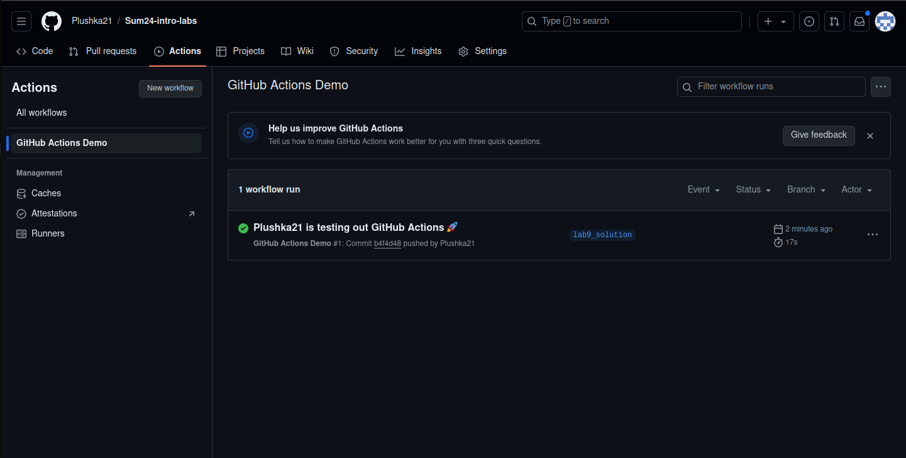
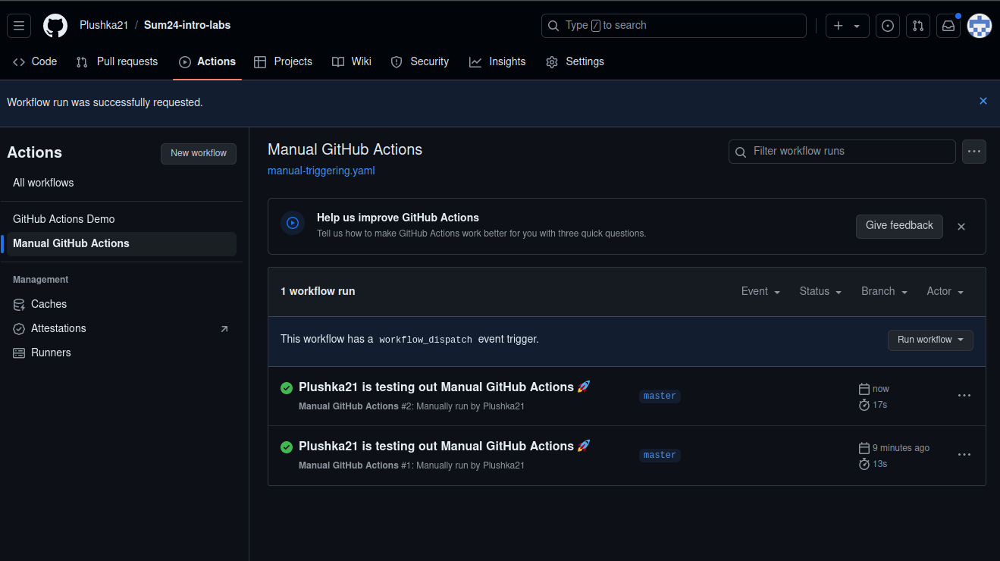

# Lab 9: CI/CD Lab - GitHub Actions
## Anton Buguev, a.buguev@innopolis.university, M23-RO-01

### Task 1. Create Your First GitHub Actions Pipelineю

1. According to official [tutorial](https://docs.github.com/en/actions/quickstart) create directory `.github/workflows` and inside that directory create file `github-actions-demo.yml`:
```yaml
name: GitHub Actions Demo
run-name: ${{ github.actor }} is testing out GitHub Actions 🚀
on: [push]
jobs:
  Explore-GitHub-Actions:
    runs-on: ubuntu-latest
    steps:
      - run: echo "🎉 The job was automatically triggered by a ${{ github.event_name }} event."
      - run: echo "🐧 This job is now running on a ${{ runner.os }} server hosted by GitHub!"
      - run: echo "🔎 The name of your branch is ${{ github.ref }} and your repository is ${{ github.repository }}."
      - name: Check out repository code
        uses: actions/checkout@v4
      - run: echo "💡 The ${{ github.repository }} repository has been cloned to the runner."
      - run: echo "🖥️ The workflow is now ready to test your code on the runner."
      - name: List files in the repository
        run: |
          ls ${{ github.workspace }}
      - run: echo "🍏 This job's status is ${{ job.status }}."
```

2. Commit and push changes to `lab9_solution` branch. After that create pull request to the main branch. This action created demo GitHub action


3. If we select this GitHub action we can see what actions exactly were performed, for example, list files in repository


4. If we commit and push changes it would automatically trigger new github action, for example, this time I commited folder `images` with 1 image inside and we can see that in GitHub Action #2 we get updated list of directories:


### Task 2: Gathering System Information and Manual Triggering.

>1. Manual trigger
1. To enable manual trigger we can create new file `manual-triggering.yaml`:
```yaml
name: Manual GitHub Actions
run-name: ${{ github.actor }} is testing out Manual GitHub Actions 🚀
on:
  workflow_dispatch:
jobs:
  Explore-GitHub-Actions:
    runs-on: ubuntu-latest
    steps:
      - run: echo "🎉 The job was MANUALLY triggered by a ${{ github.event_name }} event."
      - run: echo "🐧 This job is now running on a ${{ runner.os }} server hosted by GitHub!"
      - run: echo "🔎 The name of your branch is ${{ github.ref }} and your repository is ${{ github.repository }}."
      - name: Check out repository code
        uses: actions/checkout@v4
      - run: echo "💡 The ${{ github.repository }} repository has been cloned to the runner."
      - run: echo "🖥️ The workflow is now ready to test your code on the runner."
      - name: List files in the repository
        run: |
          ls ${{ github.workspace }}
      - run: echo "🍏 This job's status is ${{ job.status }}."
```

2. Commit and push newly created file to the `lab9_solution` branch.

3. Create and merge pull request from `lab9_solution` to `master` branch. Now we can see new kind of action in *Actions* tab and run them manually

This action basically gives the same result but we triggered it manually:


>2. Gather System Information

To gather runner information we can simply create new `check-system-info.yaml` file in `.github/workflows` directory:
```yaml
name: Gather System Info via GitHub Actions
run-name: ${{ github.actor }} is checking the system via GitHub Actions 🚀
on: [push]
jobs:
  Explore-GitHub-Actions:
    runs-on: ubuntu-latest
    steps:
      - run: echo "OS release"
      - run: cat /etc/os-release

      - run: echo "Architecture"
      - run: lscpu

      - run: echo "RAM"
      - run: free -m
```
In this file we can add terminal commands that will run when GitHub action is triggered, for example, `cat /etc/os-release` to check system info and `lscpu` to check architecture. If we open **Actions** tab and select corresponding Action we can see the output of those commands. Output contains information about runner system:
